# Exercise 02: Real-Time Data Processing with Eventstream and Notebooks
### Estimated duration: 60 Minutes

In this exercise, you will create an **Eventstream** while defining its topology for real-time data ingestion. Additionally, you will import and run a **Data Generator Notebook** to simulate streaming events.

## Lab objectives: 
In this lab, you will be able to complete the following tasks:

- Task 1: Create a new Eventstream.
- Task 2: Import Data Generator Notebook.
- Task 3: Run the notebook.
- Task 4: Define Eventstream topology.

### Task 1: Create a new Eventstream
In this task, you will be streaming events (impressions and clicks events) generated by a notebook. The events will be streamed into an eventstream and consumed by our Eventhouse KQL Database.

1. Navigate to your workspace **RTI_<inject key="DeploymentID" enableCopy="false"></inject>  (1)** from the left pane, then click on **+ New Item (2)**. In the popout window scroll a little bit down and select **Eventstream (3)**.

    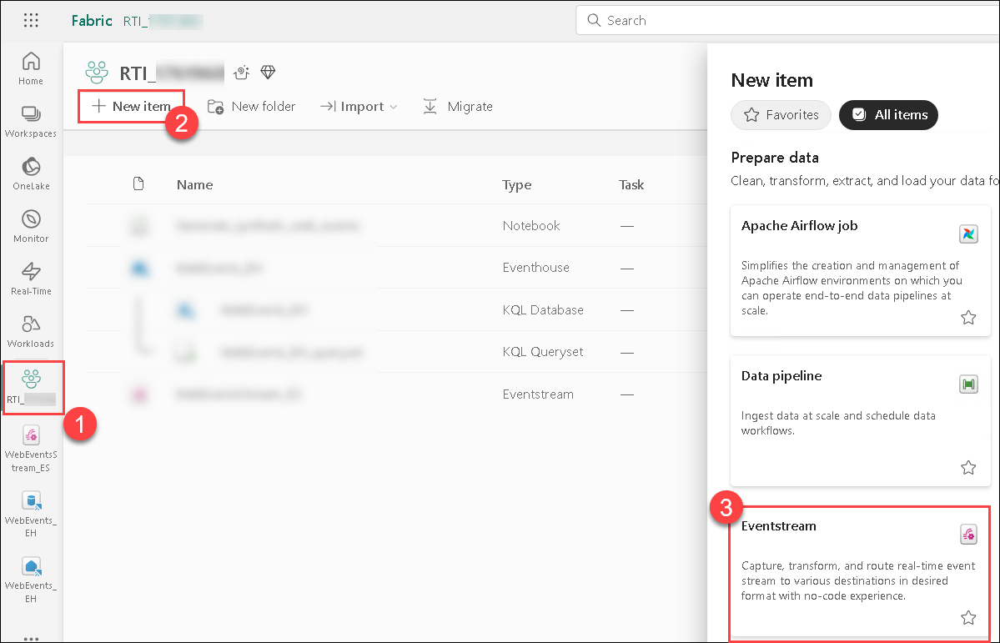

1. Give the Eventstream the name **WebEventsStream_ES (1)**. Click on **Create (2)**.

    

1. On the screen **Design a flow to ingest, transform, and route streaming events** click on **Use custom endpoint**. This will create an event hub connected to the Eventstream.

    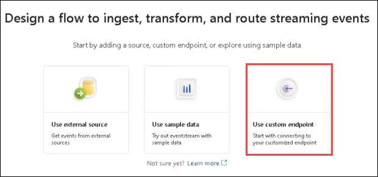

1. Insert `WebEventsCustomSource` **(1)** as the Source name and the click on **Add (2)**.

    

1. Click on **Publish** and now the Eventstream will be published and the Event Hub will be created.

    

1. To get the information we need for the Notebook, the name of the event hub and a connection string. Click on the Eventstream source named **WebEventsCustomSource**. In the area below the diagram, click on **SAS Key Authentication (1)**. Then click on the copy icon beside the **Event hub name (2)** and paste it into a notepad to use it in the later steps. 

    

1. To copy the **Connection string-primary key** you first have to click on the view icon. After the connection string is revealed click on the copy icon and copy the connection string to Notepad as well.

    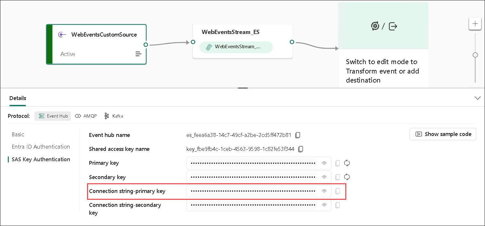

    >**Note:** To copy the connection string it must be visible.

### Task 2: Import Data Generator Notebook
We use a python notebook to generate a stream of artificial click events. The notebook can be found in **C:\LabFiles** directory.

1. Navigate back to your workspace **RTI_<inject key="DeploymentID" enableCopy="false"></inject> (1)** that you have created.

1. Click on **Import (2)** option at the top center and select **Notebook (3)** and click on **From this computer (4)** option to import notebook files from your local drive.

    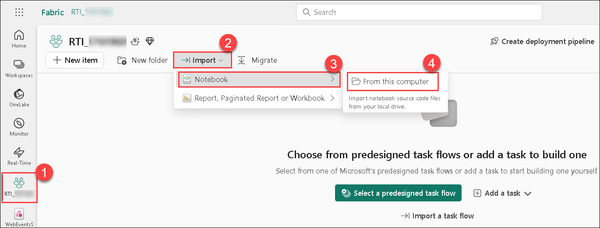

1. In the right side pane **Import status**. Select **Upload**.

    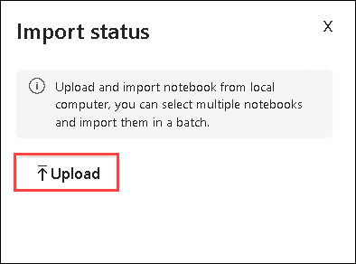

1. Browse to the **C:\LabFiles** folder and select the `Generate_synthetic_web_events` **(1)** notebook and click on the button **Open (2)**.

    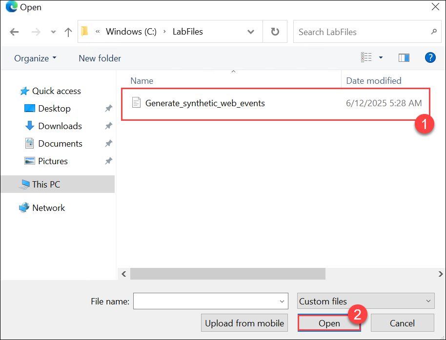

1. After the notebook has been uploaded Fabric will display a message that the notebook has been imported successfully.

### Task 3: Run the notebook
Now we have to run the notebook to create the stream of artificial click events for our lab. In order for the Notebook to send the events to the correct Event Hub we have to insert the information we have saved in Task 5 - Create Event Stream.To run the notebook and create our datastream please proceed with the following steps.

1. Click on the Notebook **Generate_synthetic_web_events** in your Fabric Workspace to open it.

    

1. Paste in the values your copied in **Task 1 - Create Event Stream** as values for `eventHubNameevents` and `eventHubConnString` into the `notebook`.

    

1. Select the **Workspace default** as the **Environment** settings.

1. Click **Run all** at the top left to start generating streaming events.

    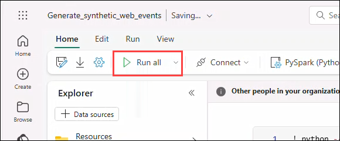

    >**Note:** Errors in Cell 1 may occur due to pre-installed libraries in the environment. These can be safely ignored, as they will not impact the successful execution of the notebook.

    
    >**Note:** Wait a few minutes for the first code cell to finish and it will proceed to next code cells automatically.

1. Scroll to the last code cell, where the generated synthetic events should begin printing in JSON format. If the output matches the provided screenshot, the notebook is successfully streaming artificial click data to the Event Hub.Let the last query run in the background, we will proceed to the next task.
    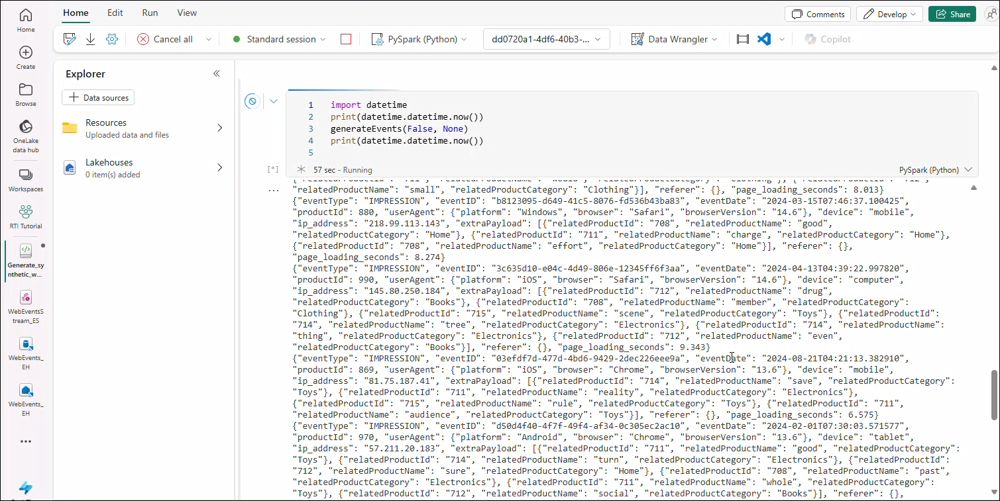

### Task 4: Define Eventstream topology
In this task, you will create the Eventstream topology that will insert the streamed data into your KQL database.

1. Open your Eventstream in your Fabric Workspace by clicking on your **RTI_<inject key="DeploymentID" enableCopy="false"></inject> (1)** icon in the left pane, and then navigating to **WebEventStream_ES (2)**.

    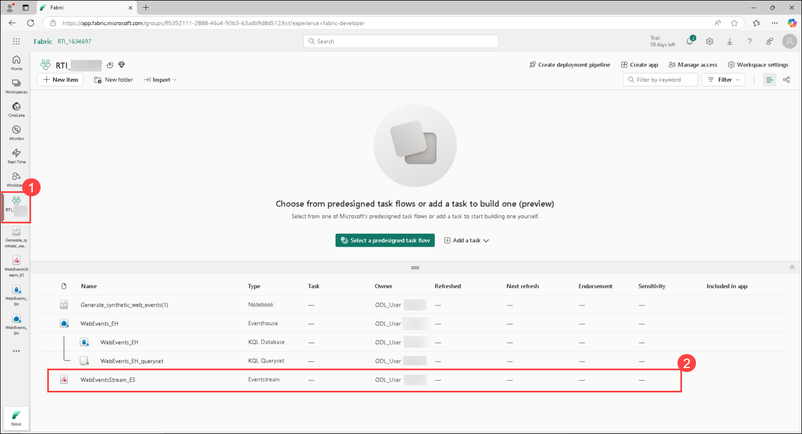

2. Click on **Edit** button located in the top-right corner.

3. Click on the node **Transform events or add destination (1)** and select **Filter (2)** from the menu.

    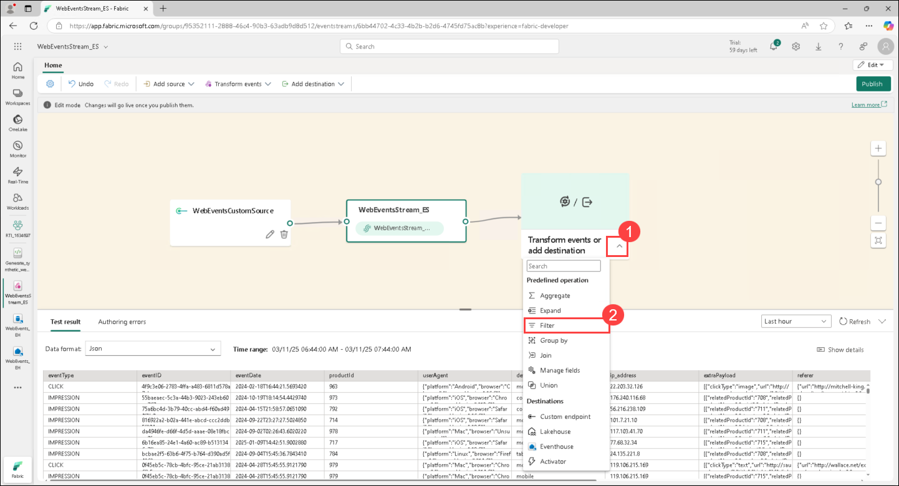

    >**Note**: Check the table at the bottom of the screen to view events streamed by the notebook to the Eventstream.

4. Click on the pencil icon in the node **Filter** to enter edit mode.

    

5. Provide the following values in the pane Filter on the left side. Then click on **Save (5)**.

    | Field                  | Value          |
    |------------------------|----------------|
    | Operation name         | **ClickEventsFilter** **(1)** |
    | Select a field to filter on | **eventType** **(2)**   |
    | Keep events when the value | **equals** **(3)**     |
    | value                  | **CLICK** **(4)**        |

    

    >**Note:** Please write the **value** exactly as given in the lab guide; it must be in capital letters.

6. The **ClickEventsFilter** node showing an **error** is expected. This indicates that there is no target for the outgoing data stream, which will be resolved in the next step.

7. Click on **+ (1)** icon next to the **ClickEventsFilter** node.

    

8. Choose **Stream** from the context menu.

    

9. Click on the **pencil (1)** in node **DerivedStream** to go to edit mode. In the right pane, Enter `ClickEventsStream` **(2)** as name of the Eventstream in the field **Stream name**. Ensure that the **Input data format** is **Json (3)**. Click on the button **Save (4)**.

    

10. Click on **+** icon next to the node **ClickEventsStream** and select the option **Eventhouse** in the context menu.

    

11. Click the pencil in node **Eventhouse (1)** to enter edit mode. Provide the following values in the pane Eventhouse and click the button **Save (9)** after you entered all the values.

    | Field                           | Value                                                                                                 |
    |----------------------------------|-------------------------------------------------------------------------------------------------------|
    | Event processing before ingestion| Ensure that this option is selected. **(2)**                                                                  |
    | Destination name                | **ClickEventStore (3)**                                                                                       |
    | Workspace                       | Select **RTI_<inject key="DeploymentID" enableCopy="false"></inject> (4)**                                  |
    | Eventhouse                       | Select the Eventhouse **WebEvents_EH (5)**                                                                     |
    | KQL Database                    | Select the KQL Database **WebEvents_EH (6)**                                                                   |
    | KQL Destination table               | Click on Create new and enter **BronzeClicks (7)** as name for the new table and click on Done.               |
    | Input data format               | Ensure that the option **Json (8)** is selected.                                                              |

    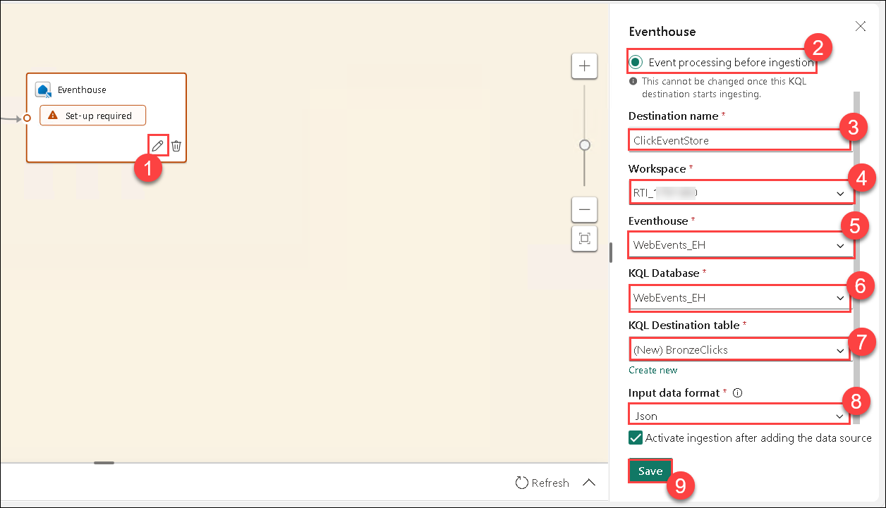

12. Click on the highlighted sign next to the node **WebEventsStream_ES** in the image below.

    

13. Choose the option **Filter** from the context menu.

    

14. Delete the connection between the new filter node **Filter** and the node **ClickEventsFilter** by clicking on the trashcan icon.

    

15. Connect the output of the node **WebEventsStream_ES** to the input of the node **ClickEventsFilter**.

    

16. Click on the **pencil** icon of the new node **Filter** to enter edit mode. Provide the following values in the pane **Filter (2)** on the right  side. Then click on **Save (2)**.

    | Field                  | Value            |
    |------------------------|------------------|
    | Operation name         | **ImpressionEventsFilter** |
    | Select a field to filter on | **eventType**      |
    | Keep events when the value | **equals**        |
    | value                  | **IMPRESSION**       |

    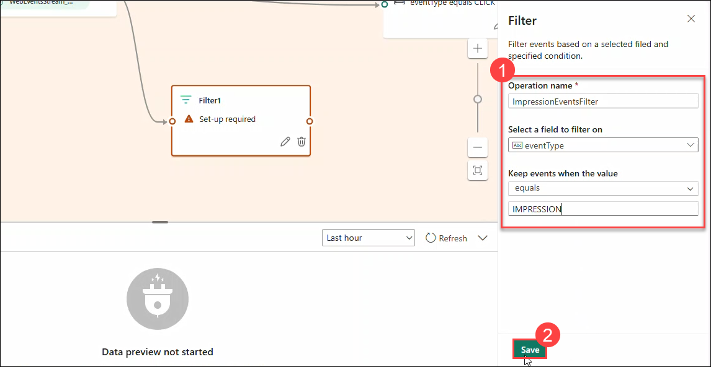

    > **Note:** Please write the value exactly as given in the lab guide; it must be in capital letters.

17. The **ImpressionEventsFilter** node showing an **error** is expected. This indicates that there is no target for the outgoing data stream, which will be resolved in the next step.

18. Click on **+** sign next to the **ImpressionEventsFilter** node and choose **Stream** from the context menu.

    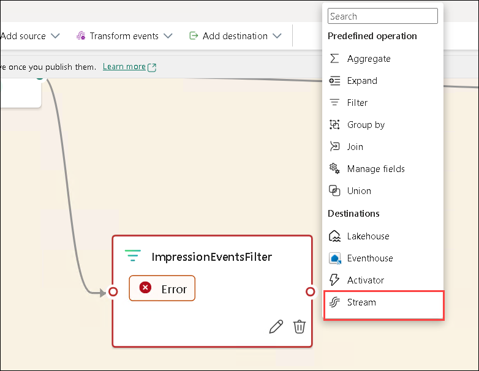

19. Click on the **pencil (1)** icon in the node **Stream** to enter edit mode. Enter `ImpressionsEventsStream` **(2)** as name of the Eventstream in the field **Stream name**. Ensure that the **Input** data format is **Json**. Click on the button **Save (3)**.

    

20. Click on **+** icon next to the node **ImpressionEventsStream** and select **Eventhouse** from the context menu.

    

21. Click the **pencil (1)** in node **Eventhouse** to enter edit mode. Provide the following values in the **pane (2)**, after providing these values click on the button **Save (3)**.

    | Field                           | Value                                                                                                 |
    |----------------------------------|-------------------------------------------------------------------------------------------------------|
    | Event processing before ingestion| Ensure that this option is selected.                                                               |
    | Destination name                | **ImpressionEventStore**                                                                                  |
    | Workspace                       | Select **RTI_<inject key="DeploymentID" enableCopy="false"></inject>**      |
    | Eventhouse                       | Select the Eventhouse **WebEvents_EH**                                                                     |
    | KQL Database                    | Select the KQL Database **WebEvents_EH**                                                                   |
    | KQL Destination table               | Click on Create new and enter **BronzeImpressions** as name for the new table and click on **Done**.           |
    | Input data format               | Ensure that the option **Json** is selected.                                                              |

    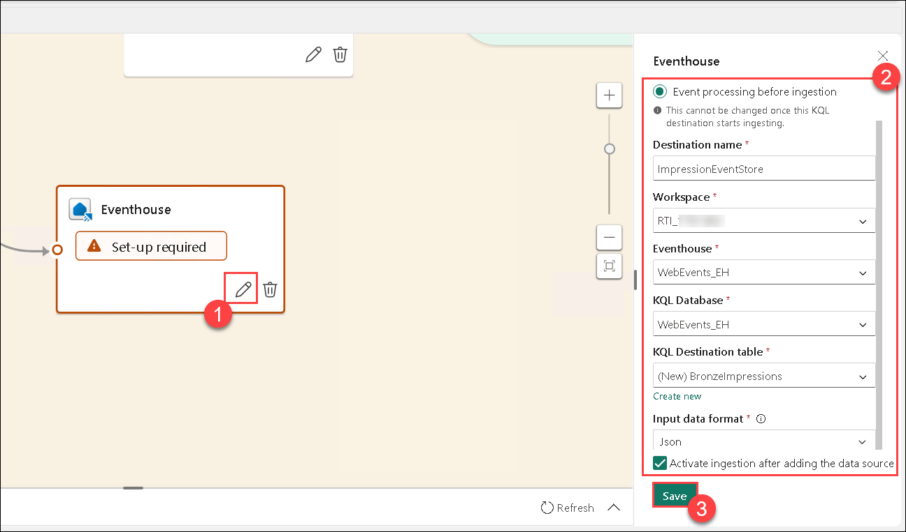
22. Click on the button **Publish** that is located in the toolbar at the top of the screen.

    

23. After a few minutes, you should see the nodes **ClickEventStore** and **ImpressionEventStore** change to mode **Active**.

    

24. At the end your Eventstream toplogy should look like the image below.

    

## Review

In this lab you have completed the following:
- Created a new Eventstream.
- Imported Data Generator Notebook.
- Run the notebook.
- Defined Eventstream topology.

### You have successfully completed the exercise. Click **Next >>** to continue.
