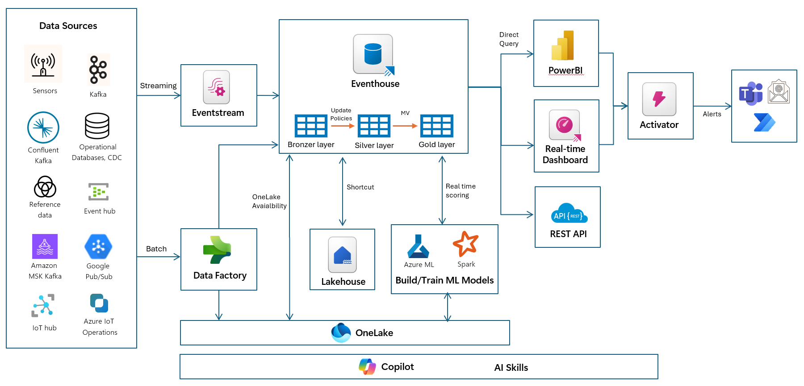
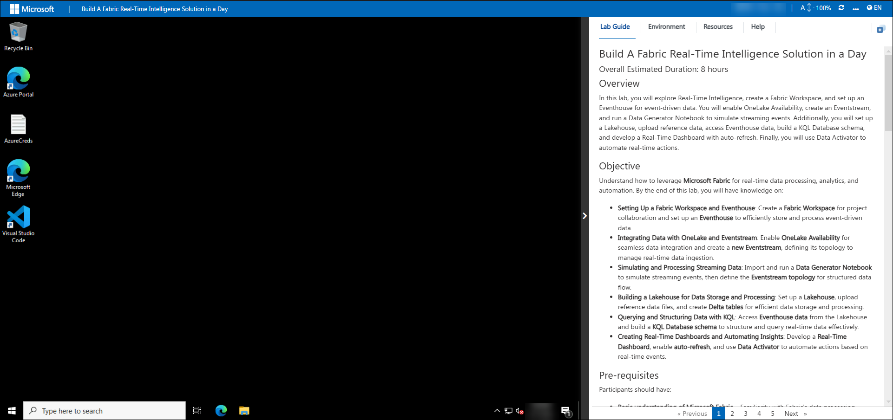
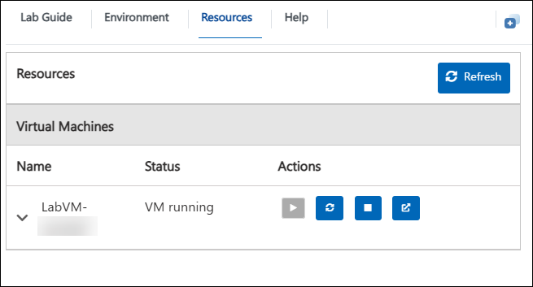
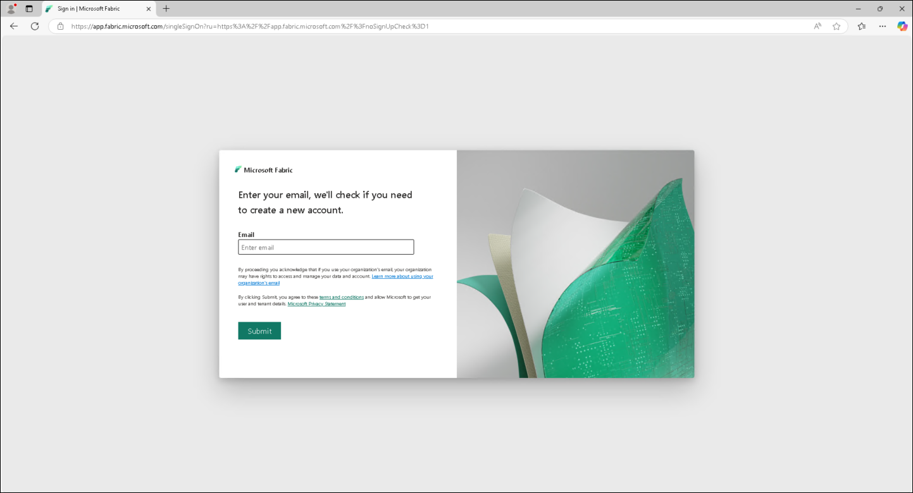
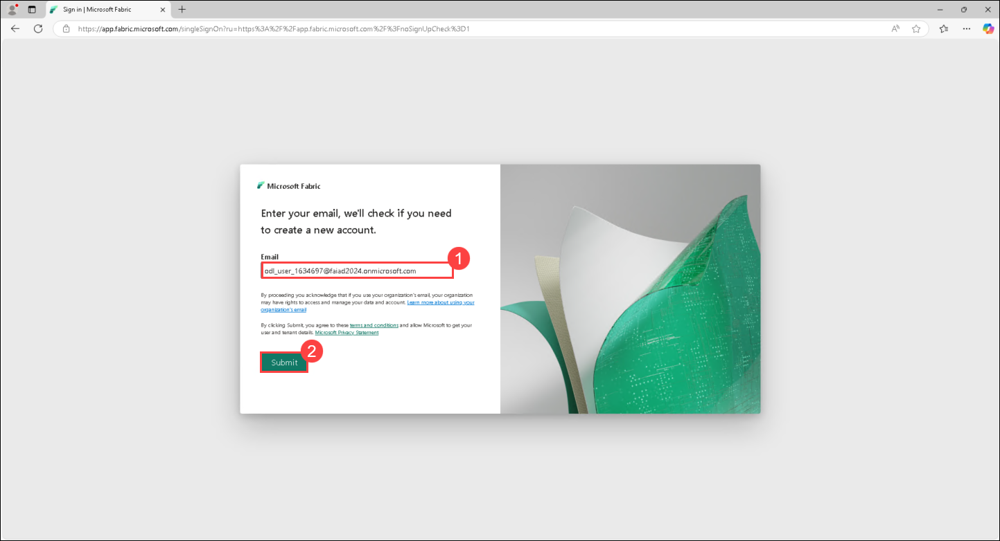
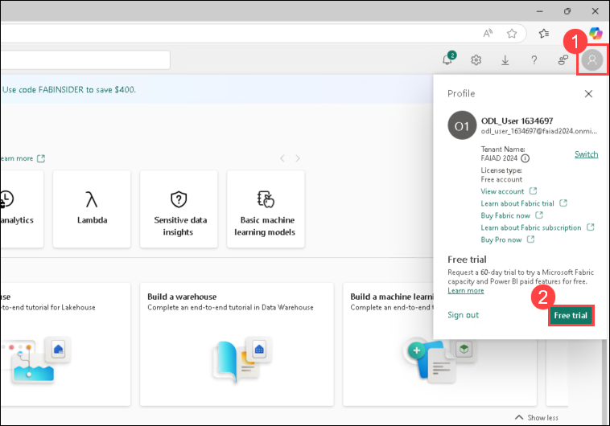
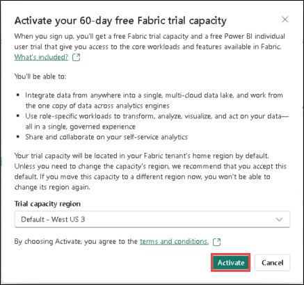

# Build a Fabric Real-Time Intelligence Solution in a Day 
### Overall Estimated Duration: 8 Hours
## Overview

In this lab, you will explore real-time intelligence, create a Fabric workspace, and set up an eventhouse for event-driven data. You will enable OneLake Availability, create an Eventstream, and run a Data Generator Notebook to simulate streaming events. Additionally, you will set up a Lakehouse, upload reference data, access Eventhouse data, build a KQL database schema, and develop a real-time dashboard with auto-refresh. Finally, you will use Data Activator to automate real-time actions.

## Objective  

Understand how to leverage **Microsoft Fabric** for real-time data processing, analytics, and automation. By the end of this lab, you will have complete knowledge about:  

- **Setting Up a Fabric Workspace and Eventhouse**: Create a **Fabric workspace** for project collaboration and set up an **Eventhouse** to efficiently store and process event-driven data.  
- **Integrating Data with OneLake and Eventstream**: Enable **OneLake Availability** for seamless data integration and create a **new Eventstream**, defining its topology to manage real-time data ingestion.  
- **Simulating and Processing Streaming Data**: Import and run a **Data Generator Notebook** to simulate streaming events, then define the **Eventstream topology** for structured data flow.  
- **Building a Lakehouse for Data Storage and Processing**: Set up a **Lakehouse**, upload reference data files, and create **Delta tables** for efficient data storage and processing.  
- **Querying and Structuring Data with KQL**: Access **Eventhouse data** from the Lakehouse and build a **KQL database schema** to effectively structure and query real-time data.  
- **Creating Real-Time Dashboards and Automating Insights**: Develop a **real-time dashboard**, enable **auto-refresh**, and use **Data Activator** to automate actions based on real-time events.  

## Prerequisites

Participants should have:  

- **Basic understanding of Microsoft Fabric** – Familiarity with Fabric’s data processing, storage, and analytics capabilities.  
- **Familiarity with real-time data processing concepts** – Understanding of streaming data, event-driven architectures, and analytics workflows.  

## Architecture

In this lab, you will build a real-time intelligence solution in Microsoft Fabric to analyze web traffic and consumer behavior for an e-commerce website. Using clickstream data, you will leverage Fabric Real-Time Intelligence to track visitor interactions and predict sales trends. The workflow includes streaming events into Fabric Eventhouse via Eventstream, performing real-time data transformations using Kusto Query Language (KQL), and utilizing OneLake availability to access data through the Lakehouse seamlessly. Additionally, you will create real-time visualizations with Fabric Real-Time Dashboards and implement Data Activator Reflex actions to automate alerts and responses based on streaming data.

## Architecture Diagram

## Explanation of Components

The architecture for this lab involves the following key components:

- **Notebook** – Generates and ingests streaming data into the system.  
- **Eventstream** – Acts as a streaming data pipeline, ingesting events from the Notebook into **Eventhouse**.  
- **Eventhouse** – A real-time analytics store that processes and structures streaming data for further use.  
- **Lakehouse** – Serves as a storage layer for structured and unstructured data, accessible via shortcuts from **Eventhouse**.  
- **Real-Time Dashboard** – Visualizes real-time data from **Eventhouse** for monitoring and insights.  
- **Data Activator** – Automates responses and alerts based on real-time streaming data.  

## Getting Started with Lab
Once you're ready to dive in, your virtual machine and lab guide will be right at your fingertips within your web browser.

## Virtual Machine & Lab Guide
Your virtual machine is your workhorse throughout the workshop. The lab guide is your roadmap to success.

## Exploring Your Lab Resources
To get a better understanding of your lab resources and credentials, navigate to the **Environment Details** tab.

## Utilizing the Split Window Feature
For convenience, you can open the lab guide in a separate window by selecting the Split Window button from the top right corner.

## Managing Your Virtual Machine
Feel free to start, stop, or restart your virtual machine as needed from the Resources tab. Your experience is in your hands!

## Let's Get Started with the Microsoft Fabric portal
 
1. Open the **Microsoft Edge browser** on your desktop and visit `https://app.fabric.microsoft.com/` in Incognito mode. You will be navigated to the login page.

    

1. Enter the following email/username, and then click on **Submit**.  

    - **Username/Email**:<inject key="AzureAdUserEmail"></inject>

      

    - **Password**:<inject key="AzureAdUserPassword"></inject> 

1. Click **Sign in** and follow the prompts to sign in to Fabric.

1. You will be navigated to the **Fabric Home**.

    
    > **Note:** Click on **Cancel** in the Welcome to Fabric view pop-up.

    To work with Fabric items, you will need a trial license and a workspace with a Fabric license. Let’s set this up.

1. On the top right corner of the screen, select the **user** **icon**.

1. Select **Free Trial**.

    

1. The "Upgrade to a free Microsoft Fabric trial" dialog opens. Select **Activate**.

    

1. The "Successfully Upgraded to Microsoft Fabric" dialog will appear. Click on the **Fabric Home Page**.      

1. You will be navigated back to the **Microsoft** **Fabric Home page**.

    

## Support Contact

The CloudLabs support team is available 24/7, 365 days a year, via email and live chat to ensure seamless assistance at any time. We offer dedicated support channels tailored specifically for learners and instructors, ensuring that all your needs are promptly and efficiently addressed.

Learner Support Contacts:

- Email Support: cloudlabs-support@spektrasystems.com
- Live Chat Support: https://cloudlabs.ai/labs-support

Click **Next** from the bottom right corner to embark on your lab journey!

### Happy Learning!!

